# Corne ZMK Config

ZMK firmware configuration for a wireless Corne split keyboard on nice!nano-compatible controllers.

This layout is based on the MoErgo GO60/TailorKey layout ideas documented here:

https://sites.google.com/view/tailorkey/moergo/go60

The keymap adapts the GO60 style to a Corne 3x6+3 layout, with bilateral home-row modifiers, thumb-driven navigation layers, a Magic utility layer, and custom RGB behavior.

## Firmware Notes

- Custom RGB is implemented as a local ZMK module in `config/corne_rgb_module`.
- Local and CI builds must include `-DZMK_EXTRA_MODULES=/path/to/config/corne_rgb_module`.
- The nested `zmk/` checkout is kept clean; custom RGB/status logic lives in the config repository.
- Root build artifacts are expected as `corne_left.uf2` and `corne_right.uf2`.

## Magic Layer

The Magic layer is reached by holding/tapping the Magic key on the lower-left key position of the base/keypad layers. A tap on the Magic hold-tap shows the RGB status overlay.

Magic provides firmware and connectivity controls:

- Bootloader and reset keys on both outer columns.
- RGB controls for speed, saturation, hue, brightness, toggle, and effect cycling.
- Media controls for mute, volume down, and volume up.
- Bluetooth profile selection for profiles 0-3 and Bluetooth clear.
- USB output selection.
- LED external-power off and toggle controls.
- Quick return to base and autoshift layer access.

Magic status overlay:

- Shows battery level as a 10-segment LED meter.
- Shows USB power status.
- On the central half, shows Bluetooth profile/connection indicators.
- Temporarily enables LED power if it was off, then restores the previous RGB/external-power state after the timeout.
- Double-tapping Magic refreshes/extends the status overlay without leaving RGB or LED power stuck on.

## RGB And Battery Fix

The keyboard has soldered addressable LEDs. Even when LEDs appear black, WS2812/SK6812-style LEDs can still consume quiescent current if their VCC rail remains powered. With 27 LEDs per half, that idle current is significant.

The current firmware reduces battery drain by:

- Enabling ZMK sleep with `CONFIG_ZMK_SLEEP=y`.
- Moving custom RGB into `CONFIG_CORNE_RGB_UNDERGLOW`.
- Disabling RGB-on-boot with `CONFIG_CORNE_RGB_UNDERGLOW_ON_START=n`.
- Using external power control on `P0.13` to cut LED VCC when RGB is off.
- Keeping Magic status power-aware: it borrows LED power briefly, displays status, then turns LED power back off if it was previously off.
- Disabling left-half polling of the right-half battery level with `CONFIG_ZMK_SPLIT_BLE_CENTRAL_BATTERY_LEVEL_FETCHING=n`.

The reactive RGB effect keeps the underglow LEDs lit and briefly lights the mapped per-key LEDs on keypress. This gives visual feedback while still allowing the LED rail to be fully powered down when RGB is toggled off.

## Visual Layer Reference

Static SVGs are generated from `config/corne.keymap` with Catppuccin Macchiato colors. Regenerate them after keymap changes with:

```bash
node scripts/generate-keymap-svgs.mjs
```

### Base Layers

#### 0: HRM macOS

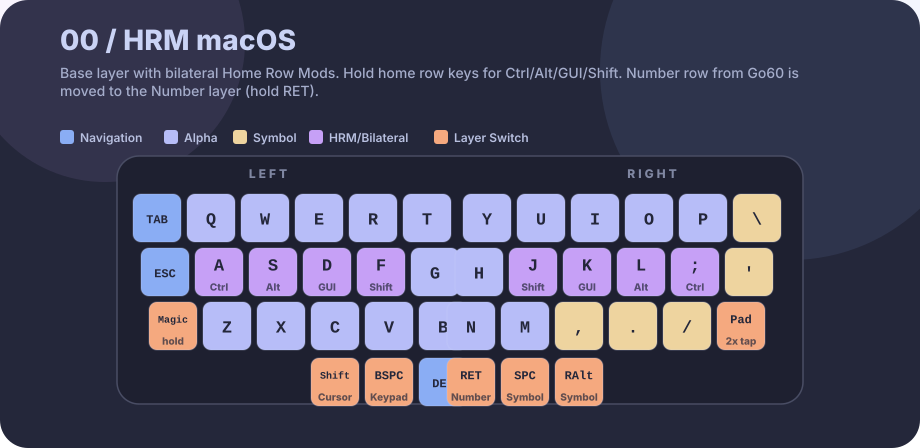

#### 1: Typing

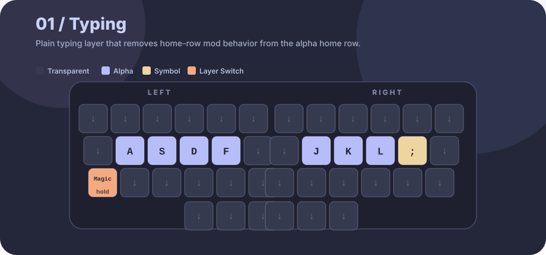

#### 2: Autoshift

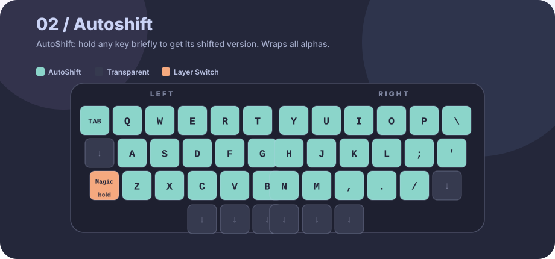

### Bilateral HRM Helper Layers

#### 3: L-Pinky

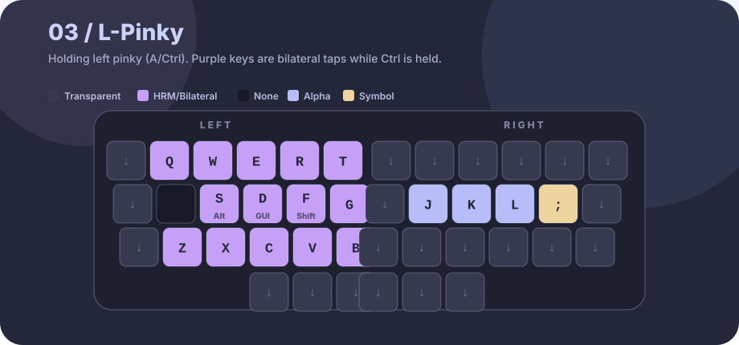

#### 4: L-Ring

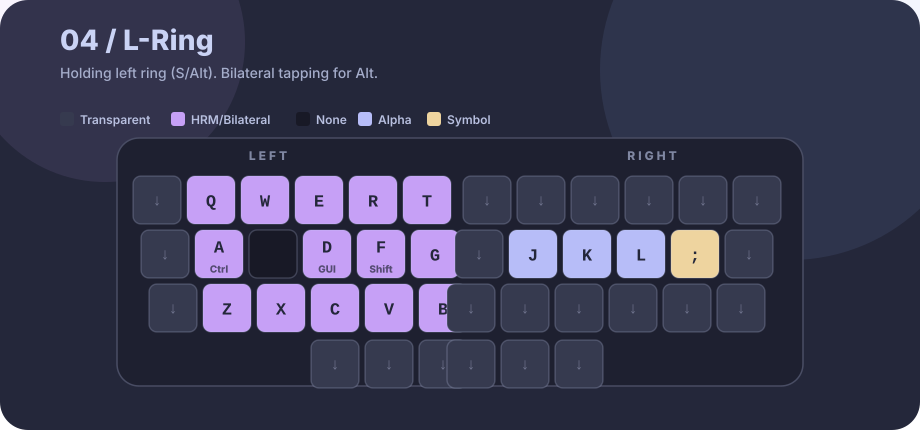

#### 5: L-Middle

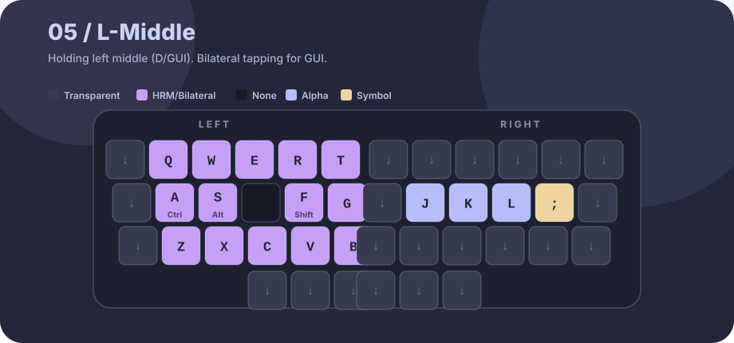

#### 6: L-Index

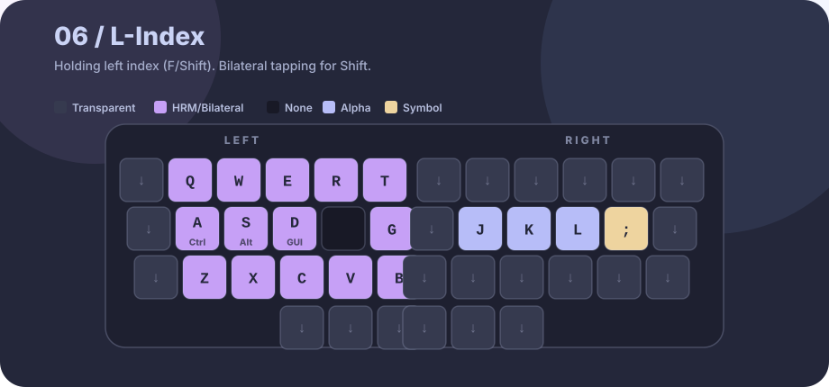

#### 7: R-Pinky

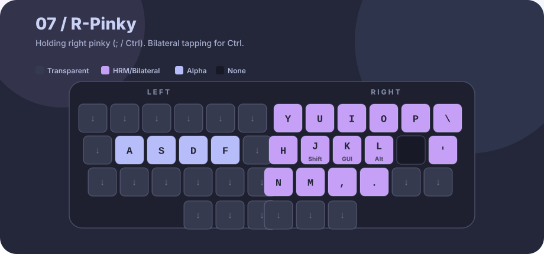

#### 8: R-Ring


#### 9: R-Middle

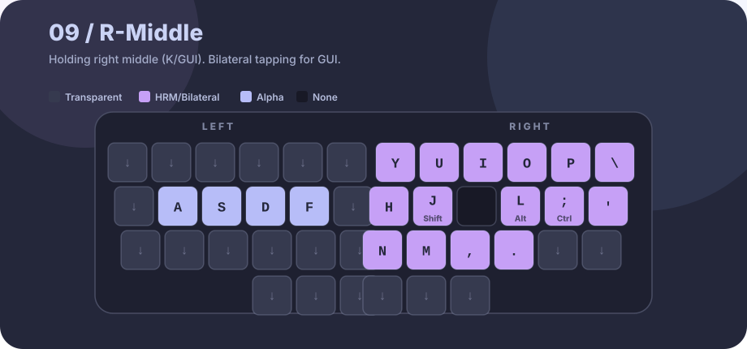

#### 10: R-Index

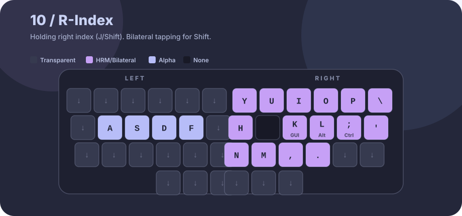

### Functional Layers

#### 11: Cursor

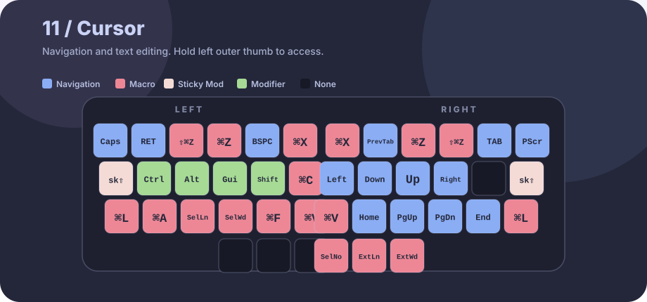

#### 12: Keypad

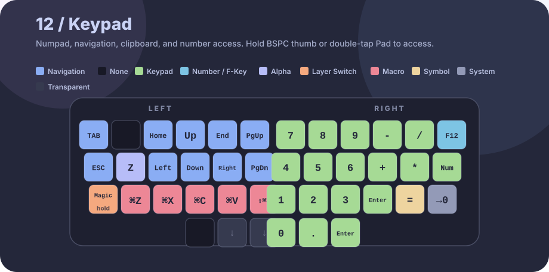

#### 13: Symbol

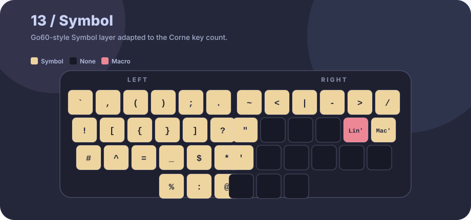

#### 14: Magic

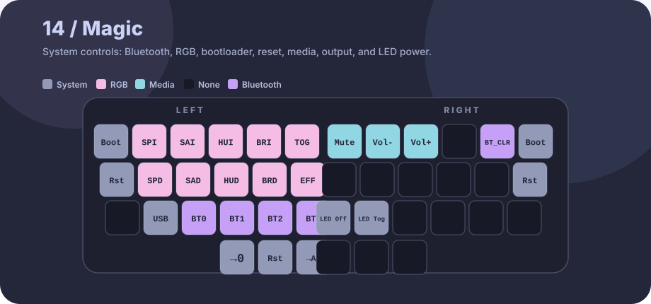

#### 15: Number

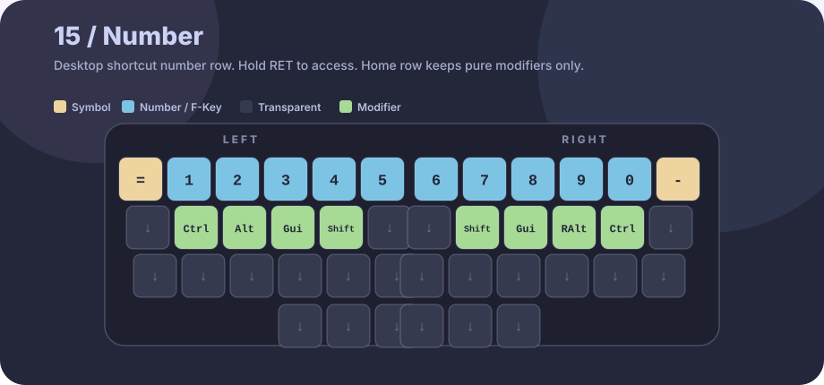
